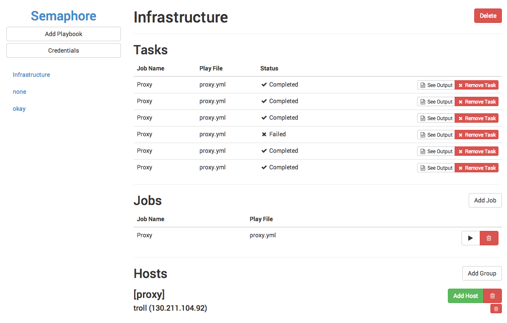

# semaphore

Open Source Alternative to Ansible Tower



## Features

The basics of Ansible Tower, but in addition:

- [x] Fast, Simple interface (not having to submit a million forms to get something simple done)
- [x] Task output is streamed live via websocket
- [x] Create inventories per playbook
- [x] Add rsa keys (to authenticate git repositories)
- [x] Run playbooks against specified hosts
- [ ] Multiple Users support

## Docker quickstart

### Run redis

```
docker run -d \
  --name=redisio \
  --restart=always \
  -v /var/lib/redisio:/var/lib/redis \
  -p 127.0.0.1:6379:6379 \
  castawaylabs/redis-docker
```

### Run mongodb

```
docker run -d \
  --name=mongodb \
  --restart=always \
  -v /var/lib/mongodb:/var/lib/mongodb \
  -p 127.0.0.1:27017:27017 \
  mongo
```

### Run semaphore

```
docker run -d \
  --name=semaphore \
  --restart=always \
  --link redisio:redis \
  --link mongodb:mongo \
  -e MONGODB_URL="mongodb://mongo/semaphore" \
  -e REDIS_HOST="redis" \
  -p 80:80 \
  redis
```

## Development

1. Install VirtualBox & Vagrant
2. Run `vagrant plugin install gatling-rsync-auto`
3. Run `vagrant up` to start the vagrant box
4. Run `vagrant gatling-rsync-auto` to synchronise changes from your local machine to vagrant

### Running semaphore inside vagrant

1. `vagrant ssh`, `cd /opt/semaphore`
2. `npm install`
3. `bower install`
4. `npm install -g nodemon`
5. `nodemon bin/semaphore`

## Initial Login

```
Email:			'admin@semaphore.local'
Password:		'CastawayLabs'
```

## Environment Variables

Use these variables to override the config.

| Variable Name | Description            | Default Value                   |
| ------------- | ---------------------- | ------------------------------- |
| PORT          | Web Port               | `80`                            |
| REDIS_PORT    | Redis Port             | `6379`                          |
| REDIS_HOST    | Redis Hostname         | `127.0.0.1`                     |
| REDIS_KEY     | Redis auth key         |                                 |
| BUGSNAG_KEY   | Bugsnag API key        |                                 |
| SMTP_USER     | Mandrill smtp username |                                 |
| SMTP_PASS     | Mandrill smtp password |                                 |
| MONGODB_URL   | Mongodb URL            | `mongodb://127.0.0.1/semaphore` |

## Vision and goals for v1

- Be able to specify environment information per playbook / per task
- Schedule jobs
- Email alerts
- Multiple user support

## Note to Ansible guys

> Thanks very much for making Ansible, and Ansible Tower. It is a great tool!. Your UI is pretty horrible though, and so we'd be happy if you could learn and use parts of this tool in your Tower.

It would be amazing if this could be your `Community Edition` of Ansible Tower.

## License

MIT
