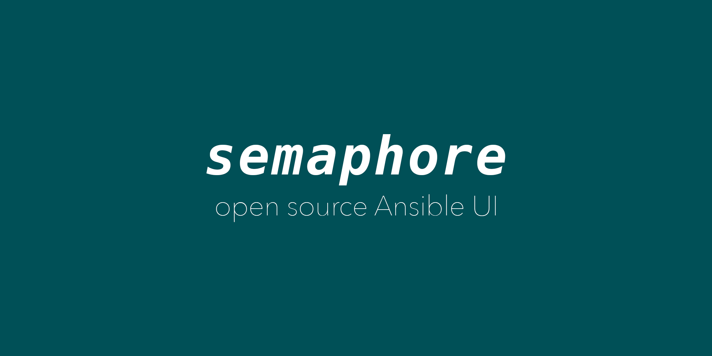

- [Releases](https://github.com/ansible-semaphore/semaphore/releases)
- [Docker Hub](https://hub.docker.com/r/ansiblesemaphore/semaphore/)
- [Install Instructions](https://github.com/ansible-semaphore/semaphore/wiki/Installation)
- [Troubleshooting](https://github.com/ansible-semaphore/semaphore/wiki/Troubleshooting)
- [Contribution Guide](https://github.com/ansible-semaphore/semaphore/blob/develop/CONTRIBUTING.md)
- [Roadmap](https://github.com/ansible-semaphore/semaphore/projects)
- [UI Walkthrough](https://blog.strangeman.info/ansible/2017/08/05/semaphore-ui-guide.html) (external blog)

## Release Signing

All releases after 2.5.1 are signed with the gpg public key
`8CDE D132 5E96 F1D9 EABF 17D4 2C96 CF7D D27F AB82`

## Installation

https://github.com/ansible-semaphore/semaphore/wiki/Installation

## Contributing

PR's & UX reviews are welcome!

Please follow the [contribution](https://github.com/ansible-semaphore/semaphore/blob/develop/CONTRIBUTING.md) guide. Any questions, please open an issue.

## License

MIT License

Copyright (c) 2016 Castaway Consulting LLC

Permission is hereby granted, free of charge, to any person obtaining a copy
of this software and associated documentation files (the "Software"), to deal
in the Software without restriction, including without limitation the rights
to use, copy, modify, merge, publish, distribute, sublicense, and/or sell
copies of the Software, and to permit persons to whom the Software is
furnished to do so, subject to the following conditions:

The above copyright notice and this permission notice shall be included in all
copies or substantial portions of the Software.

THE SOFTWARE IS PROVIDED "AS IS", WITHOUT WARRANTY OF ANY KIND, EXPRESS OR
IMPLIED, INCLUDING BUT NOT LIMITED TO THE WARRANTIES OF MERCHANTABILITY,
FITNESS FOR A PARTICULAR PURPOSE AND NONINFRINGEMENT. IN NO EVENT SHALL THE
AUTHORS OR COPYRIGHT HOLDERS BE LIABLE FOR ANY CLAIM, DAMAGES OR OTHER
LIABILITY, WHETHER IN AN ACTION OF CONTRACT, TORT OR OTHERWISE, ARISING FROM,
OUT OF OR IN CONNECTION WITH THE SOFTWARE OR THE USE OR OTHER DEALINGS IN THE
SOFTWARE.
