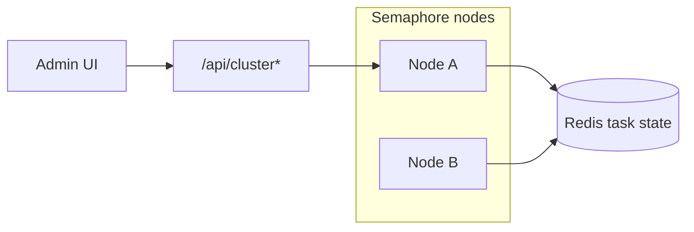

# Cluster dashboard (HA)

The cluster dashboard is an **admin-only** UI and API for inspecting high-availability (HA) deployments and the shared task state backend. It requires the enterprise HA feature (`features.high_availability`).

## When it applies

| `ha.enabled` | Dashboard |
|--------------|-----------|
| `false` | UI shows HA disabled; `GET /api/cluster` returns `{"ha_enabled": false}` only |
| `true` | Full node list, Redis stats, task snapshot, maintenance clear |

Configure HA in the server config:

```yaml
ha:
  enabled: true
  node_id: semaphore-1   # optional; auto-generated if empty
  redis:
    addr: redis.example.com:6379
    pass: "<secret>"
```

`util.HAEnabled()` is true when `ha` is set and `ha.enabled` is true.

## Admin API

All routes require an authenticated **admin** session (same as other `/api/...` admin routes).

### `GET /api/cluster`

Returns cluster status:

- `ha_enabled` (boolean) — always present
- `node_id` (string) — this instance, when HA config exists
- `nodes` (array) — peer nodes, heartbeats, versions (when HA overlay is active)
- `redis` (object) — connection, memory, key groups (when inspector available)

When HA is enabled but the cluster inspector is unavailable, the handler responds with **503** and a short error message. When HA is disabled, the response is **200** with only `ha_enabled: false` (no error).

### `GET /api/cluster/tasks`

Returns a **task state snapshot** from the task pool store:

| Field | Meaning |
|-------|---------|
| `queue` | Tasks waiting to start |
| `running` | Tasks currently executing |
| `active_by_project` | Per-project active task records |
| `aliases` | Alias string → task ID |
| `claims` | Task IDs claimed for distributed coordination |

Works in non-HA mode too (in-memory store); fields may be empty arrays/objects if the store does not implement introspection.

### `DELETE /api/cluster/tasks`

Maintenance: clear selected record groups from the backend (Redis in HA). Body:

```json
{
  "scope": {
    "queue": true,
    "running": false,
    "active": false,
    "aliases": false,
    "claims": false,
    "runtime_fields": false
  }
}
```

At least one scope flag must be `true`. Use only when recovering from a stuck cluster state (orphaned queue entries, stale claims). Clearing **running** or **active** while real tasks execute can cause inconsistent behavior.

The UI exposes the same scope checkboxes under **Clear tasks from Redis** (enabled only when `ha_enabled` is true).

## UI entry

**Admin → Cluster dashboard** (`web/src/views/Cluster.vue`):

- Node table and Redis memory chart when HA is active
- Live task tables from `/api/cluster/tasks`
- Upgrade prompt when `features.high_availability` is false

## Architecture sketch



`TaskStateStore` implementations may expose `TaskStateInspector` for snapshots and `ClearTasks`. See `services/tasks/task_state_store.go`.

## OpenAPI

Cluster endpoints are documented in `api-docs.yml` under the `cluster` tag (may be commented until Dredd hooks cover them). Regenerate the public Swagger bundle when enabling them in CI.

## Related code

- `api/cluster.go` — handlers
- `api/router.go` — route registration
- `pro_interfaces` — `ClusterInspector` for nodes/Redis
- `services/tasks/task_state_store.go` — snapshot and clear types
